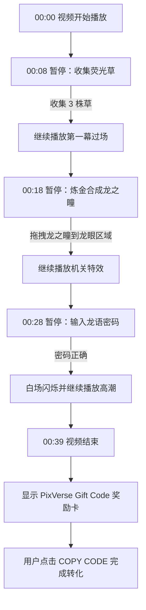

# 互动视频 Demo 交互流程设计文档

## 1. 概要

本文件用于描述一个 **互动式视频体验 Demo** 的完整时间轴、画面内容、前端交互、触发条件与状态切换逻辑。

核心体验为：

> 用户观看一段奇幻森林主题视频，并在关键时间点通过点击收集、拖拽合成、密码解密、复制奖励码等交互，完成从剧情推进到商业转化的闭环。

本版时间节点已统一更新为：

| 互动点 | 更新时间点 |
|---|---|
| 互动点 1：收集荧光草 | 00:08 |
| 互动点 2：炼金合成龙之瞳 | 00:18 |
| 互动点 3：输入龙语密码 | 00:28 |
| 互动点 4：显示奖励码 | 00:39 |

---

## 2. 交互主流程



---

## 3. 时间轴与交互设计

| 时间节点 | 画面内容 | 播放状态 | 前端 UI 与用户动作 | 触发条件与下一步指令 |
|---|---|---|---|---|
| 00:00 - 00:08 | **【第一幕引入】** 镜头在茂密发光的森林中缓慢向前推进。 | ▶️ 正常播放 `Play` | 隐藏所有交互热区，仅展示画面。 | 无 |
| 00:08 | **【互动点 1：收集】** 画面定格在森林场景，角落有散落的荧光草。 | ⏸️ 强制暂停 `video.pause()` | 显示 UI：渲染 3 个绝对定位的隐形热区覆盖在草上。底部滑出「背包栏」。用户点击热区收集。 | **触发条件：** `inventory.length === 3` <br> **下一步：** `video.play()` 继续播放过场动画，并隐藏热区。 |
| 00:08 - 00:18 | **【第一幕过场】** 拨开树丛，视线豁然开朗，展示巨大的石雕巨龙，镜头推进到龙的眼眶特写。 | ▶️ 正常播放 `Play` | 隐藏热区与炼金面板，展示纯净视频。 | 无 |
| 00:18 | **【互动点 2：拖拽】** 画面定格在巨龙空缺的眼眶特写上。 | ⏸️ 强制暂停 `video.pause()` | 显示 UI：弹出半透明的「魔法炼金阵」。用户将背包里的 3 株草拖拽到阵法中，合成「龙之瞳」，再将「龙之瞳」拖拽到视频中龙眼的坐标区域。 | **触发条件：** 拖拽碰撞检测成功 `onDrop_DragonEye` <br> **下一步：** 隐藏炼金阵 UI，执行 `video.play()` 继续播放特效视频。 |
| 00:18 - 00:28 | **【第二幕机关与过场】** 龙眼爆发出蓝光，藤蔓枯萎，地面震动裂开石阶，镜头跟随走下漆黑的地下大厅。 | ▶️ 正常播放 `Play` | 隐藏所有 UI。可叠加轻微 CSS 屏幕震动效果，增强视觉冲击。 | 无 |
| 00:28 | **【互动点 3：解密】** 画面定格在地下大厅，中央的巨大全息符文阵散发微光。 | ⏸️ 强制暂停 `video.pause()` | 显示 UI：底部弹出带有高科技发光边框的「符文控制台」密码输入框。用户输入 6 位龙语密码，如 `DRAGON`，并点击「注入魔力」。 | **触发条件：** 密码校验正确 `isCodeValid === true` <br> **下一步：** 触发 300ms CSS 白场闪烁以掩盖切帧，同时执行 `video.play()`。 |
| 00:28 - 00:39 | **【第三幕高潮】** 全息符文阵快速旋转，爆发刺眼蓝白光柱，直冲黑暗天花板。镜头上摇，画面变暗。 | ▶️ 正常播放 `Play` | 隐藏控制台 UI，全屏展示视觉高潮。 | 监听视频结束事件 `video.onended`。 |
| 00:39 End | **【互动点 4：转化】** 视频播放完毕，停留在最后一帧暗场画面。 | ⏹️ 停止 / 播放结束 `onEnded` | 显示 UI：屏幕中央通过 CSS 动画淡入并上浮，弹出「PixVerse Gift Code」毛玻璃质感奖励卡片。用户点击 `COPY CODE` 按钮复制奖励码。 | **终局：** 完成商业 / 拉新转化闭环。 |

---

## 4. 视频状态机设计

### 4.1 状态定义

| 状态名 | 说明 |
|---|---|
| `INTRO_PLAYING` | 00:00 - 00:08，第一幕引入播放中 |
| `COLLECT_PAUSED` | 00:08，暂停并等待用户收集 3 株荧光草 |
| `DRAGON_REVEAL_PLAYING` | 00:08 - 00:18，巨龙登场过场播放中 |
| `ALCHEMY_PAUSED` | 00:18，暂停并等待用户完成炼金与拖拽 |
| `MECHANISM_PLAYING` | 00:18 - 00:28，机关触发与地下大厅过场播放中 |
| `PUZZLE_PAUSED` | 00:28，暂停并等待用户输入密码 |
| `CLIMAX_PLAYING` | 00:28 - 00:39，高潮动画播放中 |
| `REWARD_SHOWN` | 00:39，视频结束并显示奖励码 |

---

## 5. 前端核心实现要点

### 5.1 时间点监听

前端需要持续监听视频播放时间，在接近关键时间点时强制暂停。

建议关键节点：

```js
const checkpoints = {
  collect: 8,
  alchemy: 18,
  puzzle: 28,
};
```

实现时建议加入容错区间，避免因为视频帧率、浏览器 `timeupdate` 触发频率或视频编码差异导致错过触发点。

```js
const triggered = {
  collect: false,
  alchemy: false,
  puzzle: false,
};

video.addEventListener("timeupdate", () => {
  const currentTime = video.currentTime;

  if (currentTime >= checkpoints.collect && !triggered.collect) {
    triggered.collect = true;
    video.pause();
    showCollectUI();
  }

  if (currentTime >= checkpoints.alchemy && !triggered.alchemy) {
    triggered.alchemy = true;
    video.pause();
    showAlchemyUI();
  }

  if (currentTime >= checkpoints.puzzle && !triggered.puzzle) {
    triggered.puzzle = true;
    video.pause();
    showRuneConsole();
  }
});
```

> 实现备注：因为视频实际时间可能出现 `8.01`、`18.03`、`28.02` 这类偏移，所以不要使用 `currentTime === 8` 这种严格等值判断。

---

### 5.2 互动点 1：荧光草收集

#### 触发时间

`00:08`

#### UI 表现

- 视频定格在森林画面。
- 3 个不可见热区覆盖在荧光草位置。
- 底部滑出背包栏。
- 点击草后，可播放微小粒子吸入背包的动画。
- 收集完成后，背包栏可短暂高亮，提示用户已获得 3 株荧光草。

#### 触发逻辑

```js
function collectGrass(itemId) {
  if (!inventory.some(item => item.id === itemId)) {
    inventory.push({
      id: itemId,
      name: "荧光草",
      type: "grass",
      icon: "glowing-grass",
    });
  }

  if (inventory.filter(item => item.type === "grass").length === 3) {
    hideCollectHotspots();
    highlightInventoryBar();
    video.play();
  }
}
```

---

### 5.3 互动点 2：炼金与拖拽

#### 触发时间

`00:18`

#### UI 表现

- 弹出半透明魔法炼金阵。
- 背包中的 3 株草可被拖入阵法。
- 合成完成后生成「龙之瞳」。
- 用户将「龙之瞳」拖拽到龙眼区域。
- 拖拽成功后，炼金阵淡出，视频继续播放。

#### 触发逻辑

```js
function craftDragonEye() {
  const grassCount = inventory.filter(item => item.type === "grass").length;

  if (grassCount >= 3) {
    removeGrassFromInventory();
    inventory.push({
      id: "dragon-eye",
      name: "龙之瞳",
      type: "crafted",
      icon: "dragon-eye",
    });

    showCraftSuccessEffect();
  }
}

function onDropDragonEye(target) {
  if (target === "dragon-eye-socket") {
    hideAlchemyPanel();
    video.play();
  }
}
```

---

### 5.4 互动点 3：符文密码输入

#### 触发时间

`00:28`

#### UI 表现

- 底部弹出发光边框的符文控制台。
- 输入框提示用户输入 6 位龙语密码。
- 正确密码示例：`DRAGON`
- 点击「注入魔力」后校验。
- 密码错误时控制台轻微震动，不使用系统 `alert`。
- 密码正确时触发 300ms 白场闪烁，掩盖切帧并增强仪式感。

#### 触发逻辑

```js
function submitRuneCode(code) {
  const isCodeValid = code.trim().toUpperCase() === "DRAGON";

  if (isCodeValid) {
    triggerWhiteFlash(300);
    hideRuneConsole();

    setTimeout(() => {
      video.play();
    }, 300);
  } else {
    showErrorShake();
    showInlineHint("龙语密码不正确，请再试一次");
  }
}
```

---

### 5.5 互动点 4：奖励码转化

#### 触发时间

`00:39 End`

#### UI 表现

- 视频结束后停留在暗场最后一帧。
- 中央显示毛玻璃质感奖励卡。
- 奖励卡淡入并轻微上浮。
- 用户点击 `COPY CODE` 复制奖励码。
- 复制成功后显示轻量提示，如 `Copied!`。

#### 触发逻辑

```js
video.onended = () => {
  setGameState("REWARD_SHOWN");
  showRewardCard();
};

async function copyGiftCode() {
  await navigator.clipboard.writeText("PIXVERSE-DRAGON-2026");
  showCopiedToast();
}
```

---

## 6. UI 组件清单

| 组件 | 用途 | 显示时机 |
|---|---|---|
| `CollectHotspot` | 荧光草点击热区 | 00:08 |
| `InventoryBar` | 背包栏，展示已收集物品 | 00:08 之后 |
| `AlchemyCircle` | 魔法炼金阵，用于合成龙之瞳 | 00:18 |
| `DragonEyeDropZone` | 龙眼拖拽目标区域 | 00:18 |
| `RuneConsole` | 符文密码输入面板 | 00:28 |
| `WhiteFlashOverlay` | 白场闪烁转场遮罩 | 密码正确后 |
| `ScreenShakeEffect` | 屏幕震动效果 | 00:18 - 00:28 机关过场 |
| `RewardCard` | PixVerse Gift Code 奖励卡 | 00:39 / 视频结束后 |
| `CopyToast` | 复制成功提示 | 点击 COPY CODE 后 |

---

## 7. 数据结构建议

### 7.1 Inventory

```ts
type InventoryItem = {
  id: string;
  name: string;
  type: "grass" | "crafted";
  icon: string;
};

const inventory: InventoryItem[] = [];
```

### 7.2 Game State

```ts
type GameState =
  | "INTRO_PLAYING"
  | "COLLECT_PAUSED"
  | "DRAGON_REVEAL_PLAYING"
  | "ALCHEMY_PAUSED"
  | "MECHANISM_PLAYING"
  | "PUZZLE_PAUSED"
  | "CLIMAX_PLAYING"
  | "REWARD_SHOWN";
```

### 7.3 Checkpoint Config

建议将所有时间节点集中配置，不要散落在多个组件中硬编码。

```ts
const CHECKPOINTS = {
  collect: 8,
  alchemy: 18,
  puzzle: 28,
  reward: 39,
} as const;
```

这样后续如果视频再次调整，只需要改一个配置，前端 UI、状态机和埋点都能保持一致。

---

## 8. 体验设计备注

### 8.1 视频与 UI 的融合重点

本 Demo 的关键不是单纯播放视频，而是让 UI 交互像是视频世界的一部分。

建议：

- 热区不要直接显示边框，可在鼠标 hover 时出现微弱发光。
- 背包栏用半透明玻璃质感，避免破坏沉浸感。
- 炼金阵可以带旋转光纹和粒子效果。
- 密码错误时不要弹系统 alert，而是让控制台轻微震动。
- 奖励卡应有明确商业转化按钮，例如 `COPY CODE` 或 `CLAIM NOW`。
- `00:28` 到 `00:39` 是高潮段，建议 UI 全部隐藏，避免遮挡视觉爆点。

---

## 9. MVP 开发优先级

| 优先级 | 功能 | 说明 |
|---|---|---|
| P0 | 视频播放与时间点暂停 | Demo 成败核心，需要准确触发 00:08 / 00:18 / 00:28 |
| P0 | 3 个互动点触发逻辑 | 收集、拖拽、密码 |
| P0 | 视频继续播放控制 | 每个互动完成后必须顺滑衔接 |
| P0 | 视频结束奖励触发 | 监听 `video.onended`，在 00:39 后展示奖励卡 |
| P1 | 背包栏 UI | 增强游戏感 |
| P1 | 炼金阵拖拽 UI | 提升互动记忆点 |
| P1 | 奖励码复制 | 完成转化闭环 |
| P2 | 粒子、震动、白场闪烁 | 增强视觉表现 |
| P2 | 音效反馈 | 点击、合成、密码正确、复制成功 |

---

## 10. 埋点建议

为了后续判断用户是否卡在某个互动点，建议加入基础埋点。

| 埋点事件 | 触发时机 | 关键参数 |
|---|---|---|
| `video_start` | 视频开始播放 | `currentTime: 0` |
| `collect_pause_show` | 00:08 暂停并展示收集 UI | `checkpoint: "collect"` |
| `grass_collected` | 每点击一株荧光草 | `itemId`, `inventoryCount` |
| `collect_complete` | 收集满 3 株草 | `currentTime` |
| `alchemy_pause_show` | 00:18 暂停并展示炼金阵 | `checkpoint: "alchemy"` |
| `dragon_eye_crafted` | 合成龙之瞳成功 | `inventoryState` |
| `dragon_eye_dropped` | 龙之瞳拖拽到龙眼区域 | `dropTarget` |
| `puzzle_pause_show` | 00:28 暂停并展示符文控制台 | `checkpoint: "puzzle"` |
| `rune_code_submit` | 用户提交密码 | `isValid` |
| `reward_show` | 00:39 视频结束并展示奖励卡 | `giftCodeType` |
| `gift_code_copy` | 用户点击 COPY CODE | `copyResult` |

---

## 11. 一句话总结

这是一个以视频为主轴、以前端 UI 为交互层的 **轻量级互动广告 / 游戏化转化 Demo**。

用户通过：

1. 在 `00:08` 收集荧光草；
2. 在 `00:18` 合成并放置龙之瞳；
3. 在 `00:28` 解开龙语密码；
4. 在 `00:39` 获得 PixVerse Gift Code；

完成从剧情参与到奖励领取的完整闭环。
