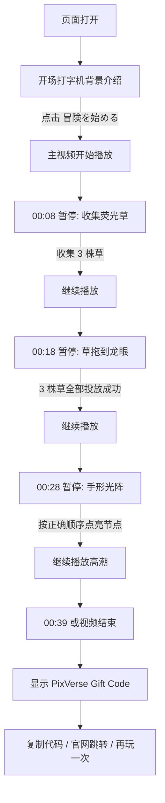

# Mystic Valley 互动视频流程设计

本文档描述当前 H5 Demo 的用户流程、时间轴、互动形式和转化闭环。当前版本已从“密码输入”调整为“手形光阵顺序解谜”，并在开场加入打字机世界观介绍。

## 1. 概要

体验定位：

> 用户进入青雾笼罩的神秘山谷，通过收集荧光草、唤醒龙眼、解开光阵，最终获得 PixVerse Gift Code，并可选择复制奖励、前往 PixVerse 官网或再玩一次。

当前互动节点：

| 节点 | 时间 | 互动 |
| :-- | :-- | :-- |
| 开场 | 进入页面 | 打字机世界观介绍 |
| 互动点 1 | `00:08` | 点击收集 3 株荧光草 |
| 互动点 2 | `00:18` | 将背包草拖到龙眼位置 |
| 互动点 3 | `00:28` | 按顺序点亮手形光阵 |
| 互动点 4 | `00:39` / 视频结束 | 显示 PixVerse Gift Code |

## 2. 主流程



## 3. 开场体验

### 触发

页面进入后立即显示。

### 表现

- 视频加载在底层，但在开场介绍期间暂停。
- 遮罩使用暗色和青色雾光，保持沉浸感。
- 文案以打字机效果逐字出现。
- 文案结束后显示开始按钮。

### 文案

```text
世界の果て、青き霧の谷。
失われたルーンを解き、
眠れる巨竜を呼び覚ませ。
旅は、ここから始まる。
```

按钮：

```text
冒険を始める
```

### 下一步

用户点击按钮后：

- 隐藏开场层。
- 调用 `video.play()`。
- 主视频从 0 秒开始播放。

## 4. 时间轴与互动设计

| 时间 | 画面阶段 | 播放状态 | UI / 用户动作 | 完成条件 |
| :-- | :-- | :-- | :-- | :-- |
| `00:00 - 00:08` | 森林 / 谷地引入 | 播放 | 不显示互动 UI | 无 |
| `00:08` | 荧光草出现 | 暂停 | 点击 3 株荧光草；底部背包显示已收集草 | 背包中有 `grass_1`、`grass_2`、`grass_3` |
| `00:08 - 00:18` | 巨龙显现过场 | 播放 | 隐藏互动 UI | 无 |
| `00:18` | 龙眼画面 | 暂停 | 背包草可拖拽；龙眼位置为不可见投放区 | 3 株草都拖到龙眼投放区 |
| `00:18 - 00:28` | 机关 / 地下大厅过场 | 播放 | 隐藏互动 UI | 无 |
| `00:28` | 光阵场景 | 暂停 | 光阵展示顺序；用户按顺序点亮节点 | 节点顺序 `[0, 2, 4, 1, 3]` 全部输入正确 |
| `00:28 - 00:39` | 高潮段落 | 播放 | 隐藏互动 UI | 无 |
| `00:39` / End | 结尾 | 暂停 / 结束 | 显示奖励卡 | 进入 `REWARD_SHOWN` |

## 5. 互动点 1：荧光草收集

### 目标

让用户在视频画面中发现并点击 3 株荧光草，建立“观察画面”的互动模式。

### UI

- 只显示荧光草图标，不显示文字按钮。
- 底部显示 3 格背包。
- 收集后对应背包槽位亮起并显示草图标。
- 顶部短提示：`光る草を集める`。

### 逻辑

```ts
function handleCollect(itemId: string) {
  addItem(itemId);

  const collectedGrassCount = nextInventory.filter((id) =>
    grassIds.includes(id)
  ).length;

  if (collectedGrassCount >= 3) {
    completeCheckpoint("collect");
    playNext("DRAGON_REVEAL_PLAYING");
  }
}
```

## 6. 互动点 2：草拖到龙眼

### 目标

保留解谜感：不直接画出明显的眼睛 UI 或进度数字，让用户根据画面和提示理解“草要给龙眼”。

### UI

- 底部背包仍然只显示 3 个草图标。
- 草图标变为可拖拽。
- 龙眼画面上有不可见 droppable 区域。
- 不显示 `0/3`、炼金阵、眼睛圈或额外计数 UI。
- 顶部短提示：`草を瞳へ`。

### 完成条件

3 株草全部被拖到 `dragon-eye-socket`。

### 逻辑

```ts
if (event.over?.id !== dragonEyeSocket.id || !grassIds.includes(itemId)) {
  return;
}

removeItem(itemId);

if (nextItems.length === 3) {
  insertDragonEye();
  onComplete();
}
```

## 7. 互动点 3：手形光阵解谜

### 目标

替代原来的“龙语密码输入”，让解谜更视觉化、触摸化，更适合移动端 H5。

### UI

- 中央显示手形光阵。
- 5 个光点围绕手形阵。
- 光阵先自动演示一遍正确顺序。
- 用户点击节点复现顺序。
- 点错后当前进度重置。
- 成功后光阵淡出，视频继续播放。
- 不再出现白色闪屏。
- 顶部短提示：`光の順をなぞる`。

### 正确顺序

```ts
const lightPattern = [0, 2, 4, 1, 3];
```

### 逻辑

```ts
function handleNodePress(node: number) {
  if (node !== lightPattern[step]) {
    resetPattern();
    return;
  }

  const nextStep = step + 1;

  if (nextStep === lightPattern.length) {
    onComplete();
  }
}
```

## 8. 互动点 4：PixVerse Gift Code

### 触发

- `currentTime >= 39`
- 或主视频触发 `ended`

### UI

奖励卡居中显示，包含：

- PixVerse Gift Code 标题
- 奖励剧情文案
- 兑换码：`PIXVERSE-DRAGON-2026`
- `コードをコピー`
- `もう一度遊ぶ`
- `公式サイトへ`

### 文案

```text
眠れる守護者が目覚めた
ルーンの謎を解き明かした探求者へ、谷からの贈り物です。
```

### 行为

| 按钮 | 行为 |
| :-- | :-- |
| `コードをコピー` | 复制 `PIXVERSE-DRAGON-2026` 到剪贴板 |
| `もう一度遊ぶ` | 调用 `resetGame()`，回到开场 |
| `公式サイトへ` | 新窗口打开 `https://pixverse.ai/ja` |

## 9. UI 组件清单

| 组件 | 显示时机 | 说明 |
| :-- | :-- | :-- |
| `IntroOverlay` | 页面初始 | 打字机世界观介绍 |
| `CollectLayer` | `00:08` | 点击收集荧光草 |
| `InventoryDock` | 收集 / 龙眼互动 | 底部背包 |
| `AlchemyLayer` | `00:18` | 草拖到龙眼区域 |
| `HiddenDragonEyeDropZone` | `00:18` | 不可见目标区 |
| `LightSigilPuzzle` | `00:28` | 手形光阵顺序解谜 |
| `HintPill` | 互动暂停时 | 少量日语提示 |
| `RewardCard` | `00:39` / End | 奖励和转化入口 |

## 10. 状态机

```ts
type GameState =
  | "INTRO_PLAYING"
  | "COLLECT_PAUSED"
  | "DRAGON_REVEAL_PLAYING"
  | "ALCHEMY_PAUSED"
  | "MECHANISM_PLAYING"
  | "PUZZLE_PAUSED"
  | "CLIMAX_PLAYING"
  | "REWARD_SHOWN";
```

阶段切换：

| 当前阶段 | 完成事件 | 下一阶段 |
| :-- | :-- | :-- |
| `INTRO_PLAYING` | 开场按钮点击 | 视频播放 |
| `COLLECT_PAUSED` | 3 株草收集完成 | `DRAGON_REVEAL_PLAYING` |
| `ALCHEMY_PAUSED` | 3 株草拖到龙眼 | `MECHANISM_PLAYING` |
| `PUZZLE_PAUSED` | 光阵顺序完成 | `CLIMAX_PLAYING` |
| `CLIMAX_PLAYING` | 到达 `00:39` 或 ended | `REWARD_SHOWN` |
| `REWARD_SHOWN` | 再玩一次 | 初始状态 |

## 11. 埋点建议

| 事件 | 触发时机 | 参数 |
| :-- | :-- | :-- |
| `intro_show` | 开场层展示 | 无 |
| `intro_start_click` | 点击开始游戏 | 无 |
| `collect_pause_show` | `00:08` 暂停 | `checkpoint: "collect"` |
| `grass_collected` | 点击一株草 | `itemId`, `inventoryCount` |
| `collect_complete` | 3 株草收集完成 | `currentTime` |
| `dragon_eye_pause_show` | `00:18` 暂停 | `checkpoint: "alchemy"` |
| `grass_dropped_to_eye` | 草投放到龙眼 | `itemId`, `dropCount` |
| `dragon_eye_complete` | 3 株草投放完成 | 无 |
| `light_sigil_show` | `00:28` 暂停 | `patternLength` |
| `light_sigil_node_press` | 点击光阵节点 | `node`, `isCorrect`, `step` |
| `light_sigil_complete` | 光阵完成 | 无 |
| `reward_show` | 奖励卡展示 | `giftCodeType` |
| `gift_code_copy` | 点击复制 | `copyResult` |
| `official_site_click` | 点击官网 | `url` |
| `replay_click` | 点击再玩一次 | 无 |

## 12. MVP 验收标准

- 页面进入后先显示开场打字机，不自动推进视频。
- 点击 `冒険を始める` 后视频开始播放。
- `00:08` 正确暂停并显示 3 株草。
- 收集满 3 株后自动继续播放。
- `00:18` 正确暂停，背包草可拖拽到龙眼。
- 3 株草全部拖入后自动继续播放。
- `00:28` 正确暂停并显示手形光阵。
- 光阵完成后无白屏，直接继续播放。
- `00:39` 或 ended 显示奖励卡。
- 奖励卡能复制 Gift Code、重玩、打开官网。
- 游戏过程中不显示右上角重置按钮。

## 13. 一句话总结

当前版本是一个以竖屏视频为主载体、以轻量 UI 作为互动层的移动端游戏化 H5：用户从世界观引入开始，通过收集、拖拽和光阵解谜完成剧情参与，最终进入 PixVerse Gift Code 奖励转化闭环。
